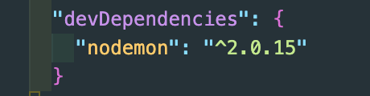
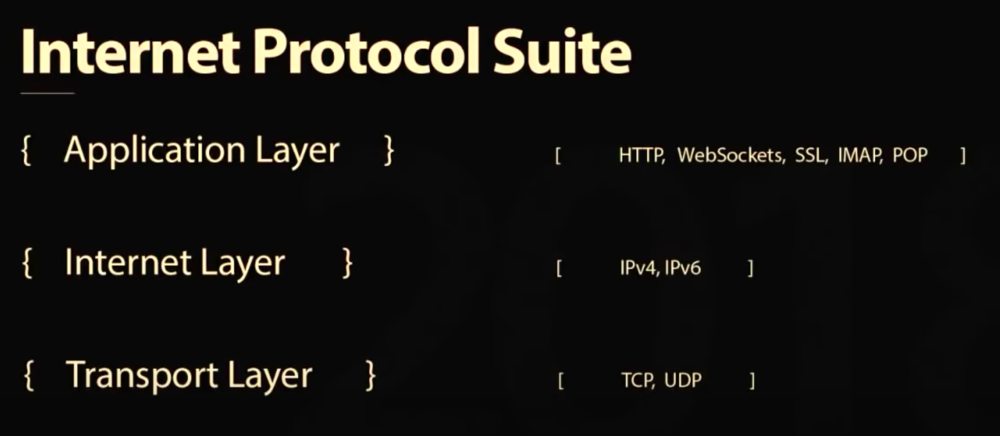

# Background

## Backend

-   [ExpressJS](https://developer.mozilla.org/en-US/docs/Learn/Server-side/Express_Nodejs/Introduction#introducing_express): Web framework for Node.js
    -   Write handlers for requests with different HTTP verbs at different URL paths (routes).
    -   Integrate with "view" rendering engines in order to generate responses by inserting data into templates.
    -   Set common web application settings like the port to use for connecting, and the location of templates that are used for rendering the response.
    -   Add additional request processing "middleware" at any point within the request handling pipeline.
    -   [Middleware](https://developer.mozilla.org/en-US/docs/Learn/Server-side/Express_Nodejs/Introduction#using_middleware) / [Static files](https://developer.mozilla.org/en-US/docs/Learn/Server-side/Express_Nodejs/Introduction#serving_static_files) / [Database](https://developer.mozilla.org/en-US/docs/Learn/Server-side/Express_Nodejs/Introduction#using_databases)
    -   `Pug`: view/templating engine. (This is recently-renamed Jade engine)
    -   `nodemon`: nodemon is a tool that helps develop node.js based applications by automatically restarting the node application when file changes in the directory are detected.
        -   Intall globally vs locally(developer dependency)
            > With a local installation, nodemon will not be available in your system path or you can't use it directly from the command line. Instead, the local installation of nodemon can be run by calling it from within an npm script (such as `npm start`) or using `npx nodemon`.
            ```bash
            npm install --save-dev nodemon
            ```
            

## Network

-   HTTP vs Ajax vs WebSockets
    
    ([https://www.youtube.com/watch?v=8ARodQ4Wlf4](https://www.youtube.com/watch?v=8ARodQ4Wlf4))
    -   HTTP is stateless. After the initial request is done, the server-client communication is lost. The client specifies actions. (GET/POST/PUT/DELETE)
    -   Ajax: Asynchronously send data to the server without refreshing.
    -   WebSockets
        -   Full-duplex bi-directional communication.
        -   WebSocket is an HTTP upgrade. Uses the same TCP connection over ws:// or wss://
        -   Easy to implement and standardize.
        -   Only sends headers once.

## How to run

-   npm install
-   npm run dev

### dependencie version

```json
"devDependencies": {
        "@babel/cli": "^7.17.6",
        "@babel/core": "^7.17.5",
        "@babel/node": "^7.16.8",
        "@babel/preset-env": "^7.16.11",
        "nodemon": "^2.0.15"
    },
    "dependencies": {
        "express": "^4.17.3",
        "pug": "^3.0.2",
        "socket.io": "^4.4.1",
        "ws": "^8.5.0"
    }
```
